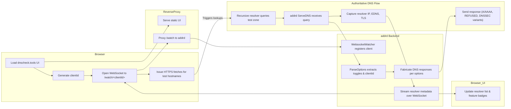

# dnscheck.tools Workflow Diagram

**Flow description**

1. The browser loads the dnscheck.tools UI, generates a random `clientId`, opens a WebSocket watcher, and issues repeated HTTPS fetches whose hostnames encode desired DNS behaviors.
2. The reverse proxy serves the static application and forwards WebSocket traffic to the `addrd` backend.
3. Recursive resolvers that the user relies on contact the authoritative handler inside `addrd`, which parses query options, fabricates matching DNS responses (including intentional REFUSED or DNSSEC variants), and records resolver metadata.
4. `addrd` streams the observed resolver addresses, transport details, and DNSSEC outcomes back to the browser over the watcher channel, allowing the UI to list each resolver and badge its capabilities in real time.
